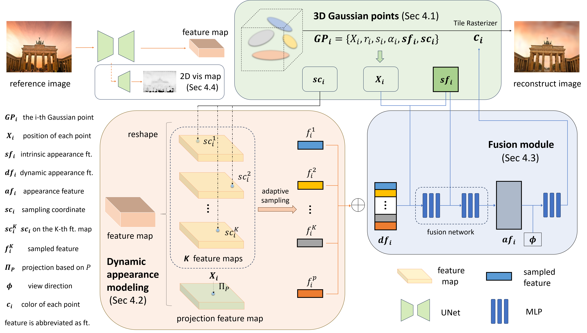

<p align="center">

  <h1 align="center">[ECCV 2024] Gaussian in the Wild: 3D Gaussian Splatting for Unconstrained Image Collections</h1>
<p align="center">
  
<!-- [Dongbin Zhang*](https://github.com/EastbeanZhang), [Chuming Wang*](javascript:void(0)),[Weitao Wang](javascript:void(0)), [Peihao Li]("https://scholar.google.com/citations?hl=en&user=LYX4AOEAAAAJ"), [Minghan Qin](https://github.com/minghanqin), [Haoqian Wang†](https://www.sigs.tsinghua.edu.cn/whq_en/main.htm)
  <br>(\* indicates equal contribution, † means corresponding author)<br>| [Webpage](https://eastbeanzhang.github.io/GS-W/) | [Full Paper](javascript:void(0)) | [Video](javascript:void(0)) |<be>-->


<p align="center">
  <a href="https://github.com/EastbeanZhang">Dongbin Zhang*</a>, 
  <a href="javascript:void(0)">Chuming Wang*</a>,
  <a href="javascript:void(0)">Weitao Wang</a>, 
  <a href="https://scholar.google.com/citations?hl=en&user=LYX4AOEAAAAJ">Peihao Li</a>, 
  <a href="https://github.com/minghanqin">Minghan Qin</a>, 
  <a href="https://www.sigs.tsinghua.edu.cn/whq_en/main.htm">Haoqian Wang†</a>
  <br>(* indicates equal contribution, † means corresponding author)<br>
</p>

<p align="center">
  <a href="https://eastbeanzhang.github.io/GS-W/">Webpage</a> | 
  <a href="https://arxiv.org/pdf/2403.15704.pdf">Full Paper</a> | 
  <a href="https://www.youtube.com/watch?v=BNIX-OmIzgo">Video</a>
</p>
    
This repository contains the official author's implementation associated with the paper "Gaussian in the Wild: 3D Gaussian Splatting for Unconstrained Image Collections", which can be found [here](javascript:void(0)).


|                             |
| :----------------------------------------------------------: |
|       Pipeline of  GS-W     |       

##

## Cloning the Repository
The repository contains submodules, thus please check it out with 
```shell
# SSH
git clone git@github.com:EastbeanZhang/Gaussian-Wild.git --recursive
```
or
```shell
# HTTPS
git clone https://github.com/EastbeanZhang/Gaussian-Wild.git --recursive
```

The components have been tested on Ubuntu Linux 18.04. Instructions for setting up and running each of them are in the below sections.

## Datasets preparation
Download the scenes (We use Brandenburg gate, Trevi fountain, and Sacre coeur in our experiments) from [Image Matching Challenge PhotoTourism (IMC-PT) 2020 dataset](https://www.cs.ubc.ca/~kmyi/imw2020/data.html) 
Download the train/test split from [NeRF-W](https://nerf-w.github.io/) and put it under each scene's folder (the **same level** as the "dense" folder, see more details in **the tree structure of each dataset**.</a>

The synthetic lego dataset can be downloaded from [Nerf_Data](https://drive.google.com/drive/folders/128yBriW1IG_3NJ5Rp7APSTZsJqdJdfc1).

#### The tree structure of each dataset
</details>

<br>


<details>

```
brandenburg_gate/
├── dense/
│   ├── images/
│   ├── sparse/
│   ├── stereo/
│ 
├──brandenburg.tsv


trevi_fountain/
├── dense/
│   ├── images/
│   ├── sparse/
│   ├── stereo/
│ 
├──trevi.tsv


sacre_coeur/
├── dense/
│   ├── images/
│   ├── sparse/
│   ├── stereo/
│ 
├──sacre.tsv


lego/
├── train/
├── test/
├── val/
├── transforms_train.json
├── transforms_test.json
├── transforms_val.json

```

</details>

## Optimizer

The optimizer uses PyTorch and CUDA extensions in a Python environment to produce trained models. 

### Hardware Requirements

- CUDA-ready GPU with Compute Capability 7.0+
- 24 GB VRAM (to train to paper evaluation quality)

### Software Requirements
- Conda (recommended for easy setup)
- C++ Compiler for PyTorch extensions (we used VS Code)
- CUDA SDK 11 for PyTorch extensions (we used 11.8)
- C++ Compiler and CUDA SDK must be compatible

### Setup
#### Environment Setup
Our default, provided install method is based on Conda package and environment management:
```shell
conda env create --file environment.yml
conda activate GS-W
```
## Training
Taking the Sacre Coeur scene as an example, more specific commands are shown in [run_train.sh](./run_train.sh).
```shell
# sacre coeur
CUDA_VISIBLE_DEVICES=0 python ./train.py --source_path /path/to/sacre_coeur/dense/ --scene_name sacre --model_path outputs/sacre/full --eval --resolution 2 --iterations 70000
```
## Render
<!-- Specific commands are shown in [run_render.sh](./run_render.sh). -->
#### Render the training and testing results
(This is automatically done after training by default)
```shell
# sacre coeur
CUDA_VISIBLE_DEVICES=0 python ./render.py  --model_path outputs/sacre/full
```
#### Rendering a multi-view video demo
```shell
# sacre coeur
CUDA_VISIBLE_DEVICES=0 python ./render.py  --model_path outputs/sacre/full --skip_train --skip_test --render_multiview_vedio
```

#### Rendering an appearance tuning demo
```shell
# sacre coeur
CUDA_VISIBLE_DEVICES=0 python ./render.py  --model_path outputs/sacre/full --skip_train --skip_test --render_interpolate
```
## Evaluation
(This is automatically done after training by default)

Similar to [NeRF-W](https://github.com/kwea123/nerf_pl), [Ha-NeRF](https://github.com/rover-xingyu/Ha-NeRF), [CR-NeRF](https://github.com/yifyang993/cr-nerf-pytorch), We evaluate the metrics of the right half image to compare with them.
```shell
# sacre coeur
CUDA_VISIBLE_DEVICES=0 python ./metrics_half.py -model_path --model_path outputs/sacre/full
```
If desired, it can also be evaluated on the whole image.
```shell
# sacre coeur
CUDA_VISIBLE_DEVICES=0 python ./metrics.py -model_path --model_path outputs/sacre/full
```

<section class="section" id="BibTeX">
  <div class="container is-max-desktop content">
    <h2 class="title">BibTeX</h2>
    <pre><code>@inproceedings{zhang2024GS-W,
  title={Gaussian in the wild: 3d gaussian splatting for unconstrained image collections},
  author={Zhang, Dongbin and Wang, Chuming and Wang, Weitao and Li, Peihao and Qin, Minghan and Wang, Haoqian},
  booktitle={European Conference on Computer Vision},
  pages={341--359},
  year={2024},
  organization={Springer}
}</code></pre>
  </div>
</section>

## Acknowledge
Our code is based on the awesome Pytorch implementation of 3D Gaussian Splatting ([3DGS](https://github.com/graphdeco-inria/gaussian-splatting)). We appreciate all the contributors.
